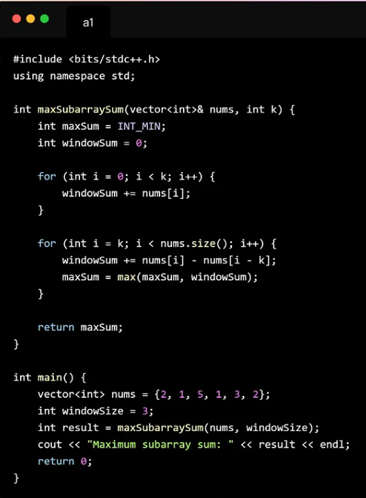

The "Dynamic Sliding Window" Blueprint
For 95% of variable-size window problems (e.g., "Longest substring," "Max consecutive ones"), the structure is ALWAYS the same:

Outer Loop (right): Expands the window by adding elements.

Inner Loop (left): Shrinks the window only when the condition is broken.

Update Answer: Happens after the window is valid again.

int slidingWindow(vector<int>& nums) {
    int left = 0; 
    int currentResult = 0; // e.g., sum, count of zeros, map size
    int maxLen = 0;

    // 1. EXPAND: 'right' always moves forward 1 step at a time
    for (int right = 0; right < nums.size(); right++) {
        
        // A. Add nums[right] to your current calculation
        // Example: currentResult += nums[right];
        // Example: map[nums[right]]++;

        // 2. SHRINK: While the window is INVALID, kick elements out from the left
        while ( /* CONDITION IS BROKEN (e.g., sum > k, zeros > k) */ ) {
            
            // B. Remove nums[left] from your calculation
            // Example: currentResult -= nums[left];
            // Example: map[nums[left]]--;
            
            left++; // Actually move the left pointer
        }

        // 3. UPDATE: Now the window is valid. Record the size.
        maxLen = max(maxLen, right - left + 1);
    }

    return maxLen;
}

Why this works
The for loop guarantees you never forget to move the right pointer. It handles the "Exploration".

The while loop handles the "Correction". It keeps running until the window is valid again.

You don't need complex if/else logic to decide which pointer moves. Right always adds. Left always removes.

Let's Apply It: Max Consecutive Ones III (LeetCode 1004)
Problem: Find the longest subarray of 1s, but you can flip at most k 0s to 1s.

Translation: Find the longest subarray with at most k zeros.

Invalid Condition: zeros > k.

int longestOnes(vector<int>& nums, int k) {
    int left = 0;
    int zeros = 0; // This is our 'currentResult'
    int maxLen = 0;

    // 1. EXPAND
    for (int right = 0; right < nums.size(); right++) {
        
        // A. Add logic: If we see a 0, increment count
        if (nums[right] == 0) {
            zeros++;
        }

        // 2. SHRINK: If we have too many zeros, shrinking is mandatory
        while (zeros > k) {
            // B. Remove logic: If the guy we are kicking out is a 0, decrement count
            if (nums[left] == 0) {
                zeros--;
            }
            left++; // Move left pointer
        }

        // 3. UPDATE
        maxLen = max(maxLen, right - left + 1);
    }
    
    return maxLen;
}

