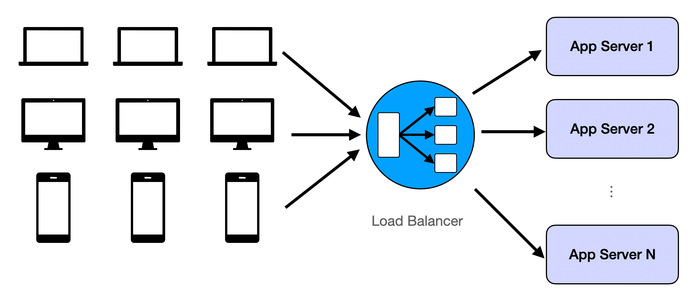
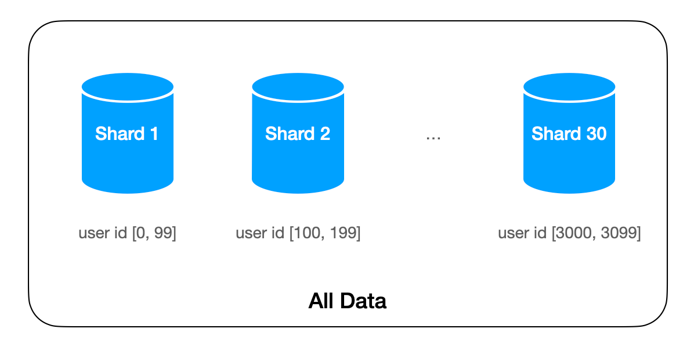
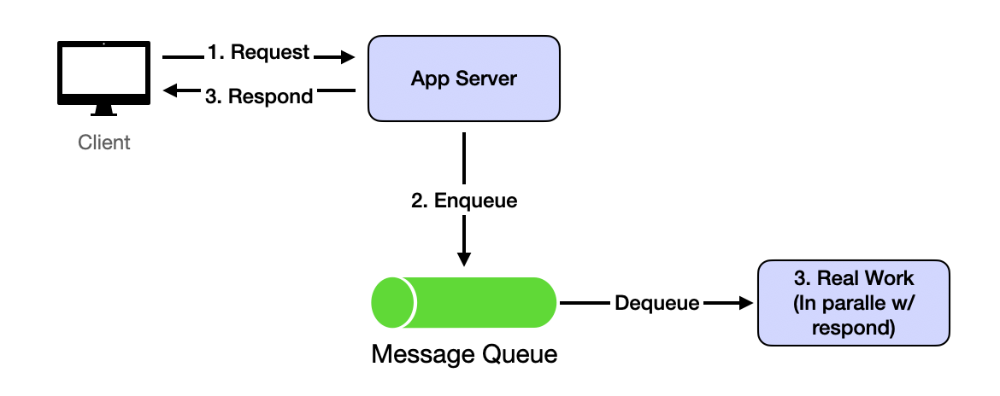
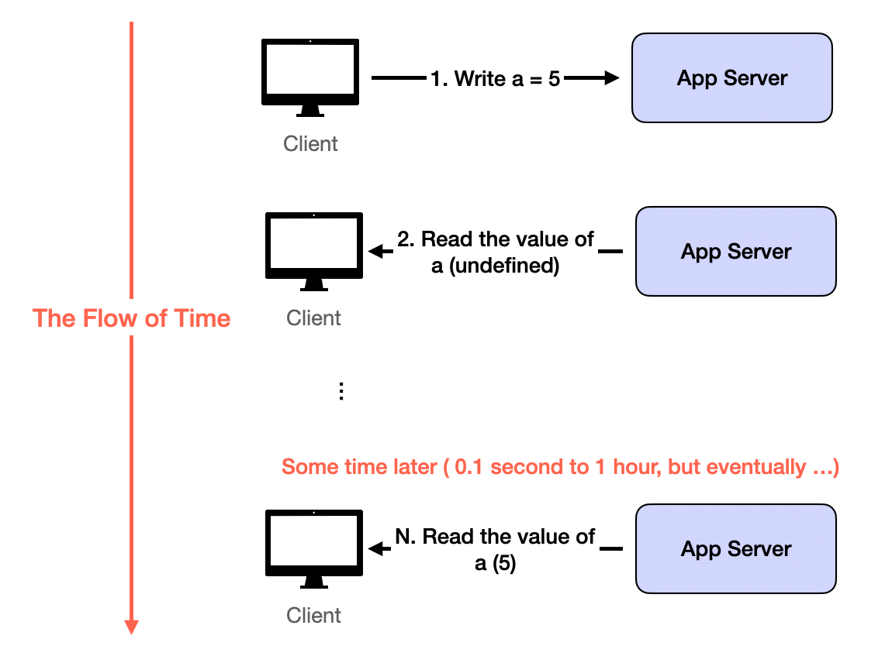

## Challenge 1: Too Many Concurrent Users

Large user bases introduce many problems. The most common and intuitive is that single machines or databases have RPS/QPS limits. In all single-server demo apps from web dev tutorials, server performance degenerates fast once limits are exceeded.

The solution is repetition. Repeat the same assets and assign users randomly to each replication. When replicated assets are server logic, it's called load balancing. When replicated assets are data, it's called database replicas.

## Challenge 2: Too Much Data to Move Around

The twin challenge of too many users is too much data. Data becomes big when it's no longer possible to hold everything on one machine. Examples: Google index, all tweets on Twitter, all Netflix movies.

The solution is sharding: partitioning data by logic. Sharding logic groups data together. If we shard by user_id in Twitter, all tweets from one user store on the same machine.

## Challenge 3: The System Should be Fast and Responsive

User-facing apps must be quick. Response time should be under 500ms. Over 1 second creates poor user experiences.

Read requests typically implement as queries to in-memory key-value dictionaries beside HTTP protocols. For many simple apps, latency is mostly network round time. 

Writing is where the challenge lies. Most typical writing processes involve many data queries and updates, lasting far longer than the 1-second limit. The solution is asynchrony: write requests return immediately after servers receive data and put it in queues. Actual processing continues in backends. After receiving server responses, client-side logic has wiggle room for speedy user experiences. It can show UI before redirecting users to read results. This usually takes 1-2 seconds, enough for backend processing of actual write requests.

This implements through message queues like Kafka.

## Challenge 4: Inconsistent (outdated) States
This challenge results from solving Challenge 1 and Challenge 2. With data replication and asynchronous data updates, read requests can easily see inconsistent data. Inconsistency usually means outdated: users won't see random wrong data, but old versions or deleted data.

The solution is more application-level than system-level. Outdated reads from replication and asynchronous updates eventually disappear when servers catch up. Build user experiences where seeing outdated data briefly is acceptable. This is eventual consistency.

Most apps tolerate eventual consistency well, especially compared with alternatives: losing data forever or being very slow. Exceptions are banking or payment-related apps. Any inconsistency is unacceptable, so apps must wait for all processing to finish before returning anything to users. That's why such apps feel much slower than Google Search.

