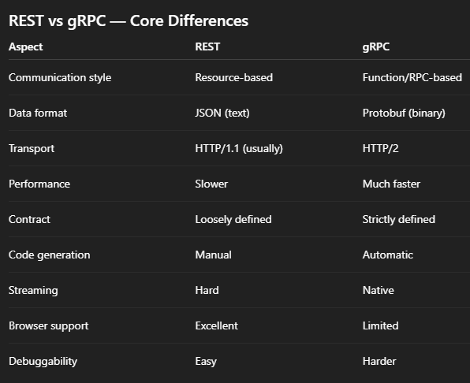

gRPC (Google Remote Procedure Call) is a high-performance RPC framework designed for service-to-service communication.

Instead of “sending HTTP requests to URLs”, you call a function on a remote service as if it were local.

`userService.GetUser(userId)`
 This call is serialized, sent over the network, executed remotely, and the result is returned.

## How gRPC works (under the hood)
- Interface :  definition
You define services and messages using Protocol Buffers (.proto)
- Code generation : 
gRPC generates:
Client stubs, Server skeletons
in multiple languages.
- Transport : Uses HTTP/2, Binary data (protobuf), Multiplexed streams over a single connection
- Execution : Client calls a method, Server executes it. 

gRPC .proto

` service UserService {
  rpc GetUser (UserRequest) returns (UserResponse);
} ` 

This feels like a function call, not an HTTP endpoint.

gRPC can be 5–10× faster than REST in microservice environments.